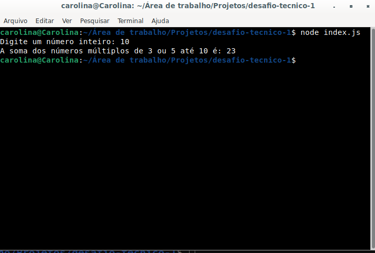

# Desafio técnico 1


### Objetivo
<hr/>
<p>Este programa solicita ao usuário que insira um número inteiro e calcula a soma de todos os números múltiplos de 3 ou 5 até o número fornecido.</p>

### Tecnologias
- JavaScript
- Node.js

### Como utilizar este programa
<hr/>
<p>Certifique-se de ter o Node.js instalado (https://nodejs.org/en).</p>

1. Faça o clone deste repositório:
```bash
git clone https://github.com/carolcampos22/desafio-tecnico-1
```
2. Abra o terminal no diretório (pasta) onde o código está localizado;

3. Execute o programa com o seguinte comando:
```bash
node index.js
```
4. O programa irá solicitar que digite um número. Após digitar, aperte "Enter" e o resultado aparecerá.



### Autora
#### Carolina Mendes - Web Developer
[](https://www.linkedin.com/in/dev-carolina-mendes/)